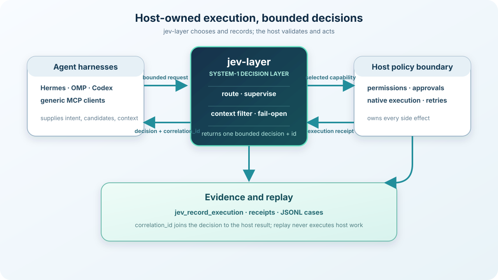

<p align="center">
  
</p>

<h1 align="center">jev-layer</h1>

<p align="center">
  <strong>Portable System-1 decision layer for agent harnesses.</strong><br>
  Host-owned routing, receipts, replay, and fail-open integrations.
</p>

<p align="center">
  Hermes · OMP · Codex · generic MCP
</p>

<p align="center">
  <a href="https://github.com/typakon4/jev-layer/actions/workflows/ci.yml?query=branch%3Amain"></a>
  <a href="https://www.npmjs.com/package/jev-layer"></a>
  <a href="https://github.com/typakon4/jev-layer/releases"></a>
  <a href="https://github.com/typakon4/jev-layer/blob/main/LICENSE"></a>
</p>

[English](README.md) · [Русский](README.ru.md) · [简体中文](README.zh-CN.md)

jev-layer routes bounded choices and records evidence; the host keeps execution, permissions, approvals, retries, recovery, and final results.

> Integrating jev-layer into a harness? Start with the [Agent implementation guide](docs/AGENT-IMPLEMENTATION.md), not this README alone.

## Architecture

<p align="center">
  
</p>

Jev never executes a selected capability. A provider can be deterministic `demo`, OpenRouter Decisions, or TypeSafe; provider-backed tests are not required for normal CI.

## Quick Start

Requirements: Node.js 20 or newer. There are no mandatory runtime dependencies.

Install the published CLI:

```sh
npm install --global jev-layer
```

Or use a local clone:

```sh
npm install
npm link
jev install --project /path/to/workspace
jev add generic --project /path/to/workspace
jev doctor --project /path/to/workspace
```

`npm link` is local only. It does not publish the package. Use `node /path/to/jev-layer/bin/jev.mjs ...` instead if a global link is not wanted. The default `demo` provider is offline and deterministic.

To call the stdio MCP server directly:

```sh
jev mcp
```

To use a provider with credentials, keep keys outside the repository:

```sh
export JEV_LAYER_PROVIDER=openrouter
export OPENROUTER_API_KEY='provided-by-your-secret-store'
jev doctor --project /path/to/workspace
```

All three modes (`demo`, `openrouter`, and direct `typesafe`), their endpoints, and configuration precedence are documented in the [provider guide](docs/PROVIDERS.md).

## Core surfaces

- **Routing:** `jev_route` selects one capability from the host-supplied candidate set. Selection is advisory; the host validates the id and permissions.
- **Receipts/replay:** `jev_record_execution` joins the host result to the original `correlation_id`. JSONL cases live in `.jev/replay/cases.jsonl` and can be evaluated offline with `npm run replay:evaluate`.
- **Supervision:** `jev_supervise` returns bounded work-state judgments; deterministic host policy maps them to `continue`, `verify`, `retry`, `finish`, or `escalate`. Jev does not perform those actions.
- **Context filtering:** optional deterministic `shadow` or `conservative` filtering reduces stale context without LLM summarization.
- **Experimental browser fast-path:** `jev_browser_step` chooses one bounded action from a host observation. The host supplies observations, approval, native execution, and recovery. It is opt-in and does not start a browser worker.
- **Fail-open:** disabled, unavailable, invalid, or inconclusive Jev calls return control to the host's normal path. Jev never widens permissions or guesses execution.

All optional surfaces are disabled by default:

```sh
JEV_BROWSER_FAST_PATH=1 jev mcp
JEV_SUPERVISION=1 jev mcp
JEV_CONTEXT_FILTER=shadow jev cli --input examples/route-request.json
```

## Harness adapters

Current examples live under `integrations/`:

- `integrations/hermes/`
- `integrations/omp/`
- `integrations/codex/`
- `integrations/template/`

The release baseline records OMP `18.2.6`, Hermes `0.21.3` (`b675e6de`), and Codex CLI `0.155.1` observed in the preparation environment. This is a version/contract baseline, not a claim of full provider/model coverage; see [docs/COMPATIBILITY.md](docs/COMPATIBILITY.md).

Adapters are intentionally thin. They may call the CLI or stdio MCP, but the host must retain native capability lookup, permissions, approvals, execution, retries, recovery, and final output.

### Adding a new harness

The shortest PR path is:

1. copy `integrations/template/adapter.mjs`;
2. add `integrations/<harness>/` and a secret-free config/example;
3. call `jev_route`, preserve `correlation_id`, execute only through the host registry, then call `jev_record_execution`;
4. add an offline smoke fixture for success, fail-open, approval denial, and execution receipt;
5. document supported versions and run CI.

See [CONTRIBUTING.md](CONTRIBUTING.md) for the adapter contract and [docs/SCHEMA-VERSIONING.md](docs/SCHEMA-VERSIONING.md) for compatibility rules.

## Browser status

Browser fast-path **reliability is validated against the current real-browser fixtures**, including action sequencing, visible-link navigation, native select execution, approval denial, and recovery. **Performance optimization remains experimental**. No browser speedup claim is made.

## Security and compatibility

- MIT licensed; see [LICENSE](LICENSE).
- jev-layer is not a security boundary. Host permissions and approvals are authoritative; see [SECURITY.md](SECURITY.md).
- Schema, MCP tool, receipt, replay, and adapter contracts are currently version 1. Prefer additive changes; do not break v1 silently.
- Do not commit credentials, logs containing secrets, `.env` files, or machine-specific paths.

## Verification

```sh
npm test
npm run smoke
npm run fail-open-smoke
npm run clean-install-smoke
npm pack --dry-run
```

The GitHub Actions matrix runs these checks on Node.js 20, 22, and 24. Provider-backed tests require an explicitly configured secret-managed environment and are not part of ordinary PR CI.

## Release documents

- [CONTRIBUTING.md](CONTRIBUTING.md)
- [SECURITY.md](SECURITY.md)
- [RELEASE.md](RELEASE.md)
- [CHANGELOG.md](CHANGELOG.md)
- [Agent implementation guide](docs/AGENT-IMPLEMENTATION.md)
